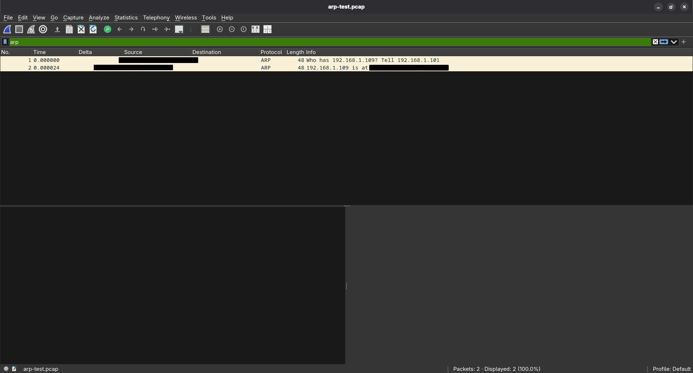
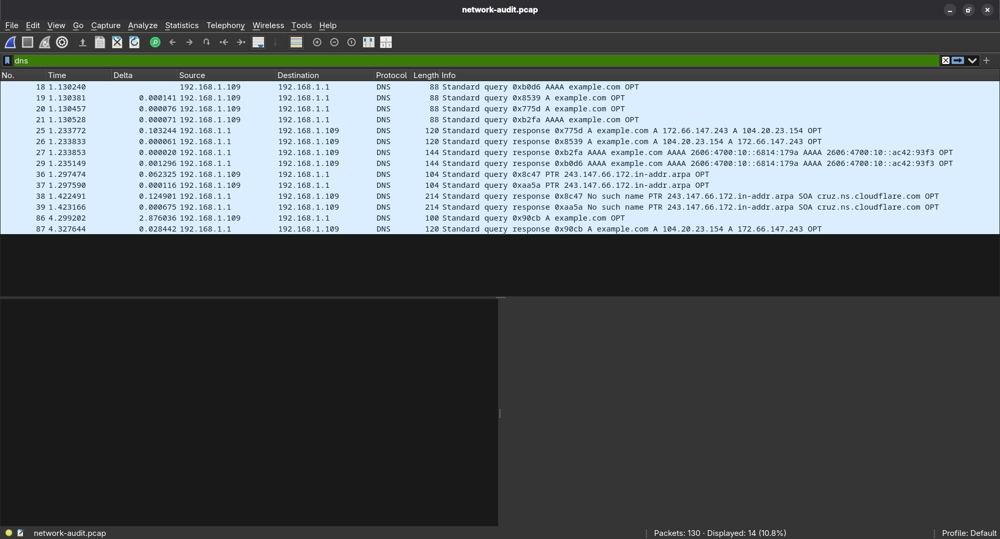
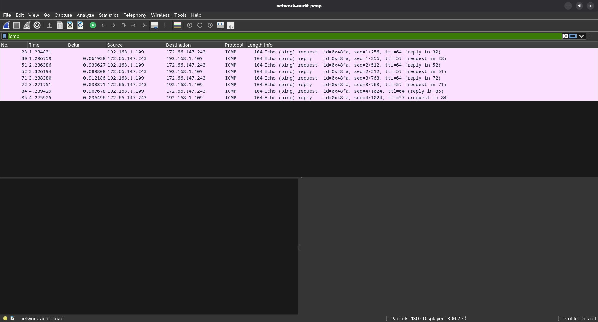
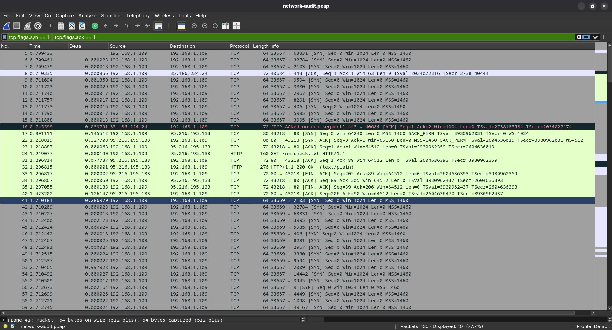
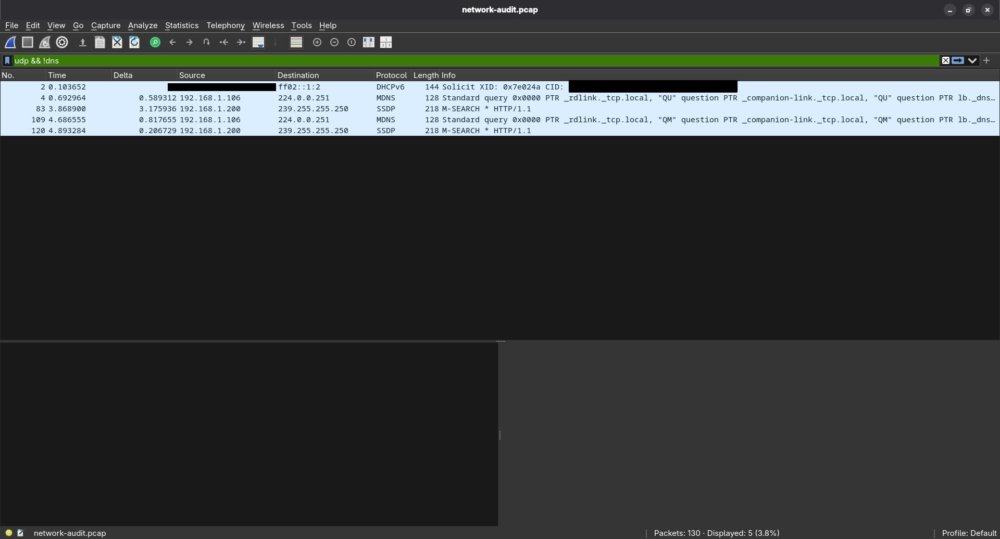

# Network Traffic Analysis

Practical network traffic analysis performed as part of my cybersecurity learning roadmap.

This project represents the practical part of my networking studies, which were split across **two weeks**. The first part focused on networking fundamentals, while the second part focused on protocols, packet analysis, and understanding how network communication appears in real traffic.

## Objective

The goal of this project was to move from studying networking concepts theoretically to observing them in real network traffic.

I captured traffic from my own environment and analyzed it using Wireshark to understand how common networking protocols behave at the packet level.

## Environment

* Arch Linux
* Wireshark
* tcpdump
* ping
* dig
* curl

## Traffic Capture

Network traffic was captured locally using `tcpdump` and saved as a PCAP file for later analysis in Wireshark.

Example capture command:

```bash
sudo tcpdump -i any -w week4.pcap
```

Additional traffic was generated using common networking utilities:

```bash
ping example.com
dig example.com
curl https://example.com
```

The captured traffic was then examined in Wireshark using protocol-specific filters.

---

# Protocol Analysis

## ARP

ARP was analyzed to understand how IPv4 addresses are resolved to MAC addresses on a local network.

The capture showed both parts of the exchange:

**ARP Request → ARP Reply**

This allowed me to connect the theoretical ARP process with actual packets observed in a network capture.



---

## DNS

DNS traffic was analyzed to understand how domain names are resolved.

The capture included:

* A queries
* AAAA queries
* PTR queries
* corresponding DNS responses

This helped me understand how DNS requests and responses appear at the packet level and how different DNS record types are used.



---

## ICMP

ICMP traffic was generated using `ping`.

The capture showed the expected:

**Echo Request → Echo Reply**

I also observed ICMP identifiers, sequence numbers, and TTL values while comparing requests with their corresponding replies.



---

## TCP

TCP was one of the main parts of the practical analysis.

The capture showed the TCP three-way handshake:

**SYN → SYN/ACK → ACK**

I also observed:

* source and destination ports;
* ephemeral ports;
* TCP flags;
* sequence numbers;
* acknowledgement numbers;
* data transfer;
* HTTP communication;
* connection termination using FIN/ACK.

This helped connect the TCP concepts studied previously with actual packet-level communication.



---

## UDP and Local Service Traffic

UDP traffic was analyzed together with several types of local network service and discovery traffic.

The capture included:

* DHCPv6
* mDNS
* SSDP

These packets demonstrated how UDP is used by various network services and how multicast traffic appears during local service discovery.



---

# Key Findings

The practical analysis helped me understand how networking concepts appear in real packet captures rather than only in theory.

During the analysis I practiced:

* identifying protocols from captured packets;
* understanding source and destination addresses;
* identifying source, destination, and ephemeral ports;
* following TCP communication;
* identifying TCP flags;
* reading sequence and acknowledgement numbers;
* identifying DNS queries and responses;
* recognizing ARP address resolution;
* identifying ICMP request/reply pairs;
* distinguishing local and multicast traffic;
* using Wireshark filters to isolate specific protocols.

The main goal was not simply to collect packets, but to understand what was happening between the packets and why.

# Tools Used

### tcpdump

Used to capture network traffic and save it for later analysis.

### Wireshark

Used to inspect individual packets, apply filters, and analyze protocol behavior.

### ping

Used to generate ICMP Echo Request and Echo Reply traffic.

### dig

Used to generate DNS queries and inspect DNS responses.

### curl

Used to generate HTTP traffic over TCP.

# Screenshots

The screenshots included in this project show examples of the traffic analyzed during the practical work.

Sensitive device identifiers were removed from the screenshots before publication.

## ARP


## DNS


## ICMP


## TCP


## UDP / DHCPv6 / mDNS / SSDP


# Scope

All traffic analyzed in this project was captured from my own environment.

The project was performed for educational purposes as part of my cybersecurity learning roadmap.

The published screenshots were reviewed and sensitive device identifiers were removed before being added to the repository.
